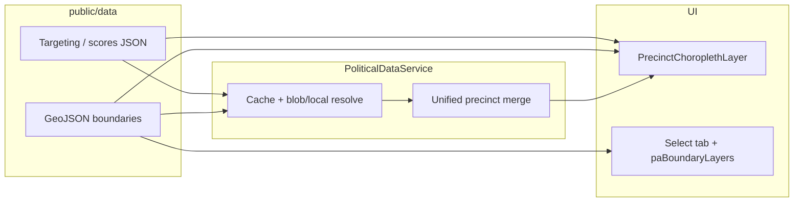

# Political analysis: state data onboarding & porting guide

This document is for engineers who clone this codebase as a **boilerplate** for a new state or who need to **swap Pennsylvania (PA) assets** for another jurisdiction. It describes **what data exists today**, **what the client should supply**, and **which files and scripts to change**.

---

## 1. How data flows through the app



- **Choropleth map**: loads precinct **boundaries** (GeoJSON), joins **targeting scores** by a stable precinct key, and enriches features for click/hover.
- **Select tab** (boundaries + click-select): uses **`lib/political/paBoundaryLayers.ts`** (PA paths + field names) and **`loadBoundaryFeatureCollection`** for multi-part GeoJSON.
- **`PoliticalDataService`** (`lib/services/PoliticalDataService.ts`): resolves **blob URLs** (production) vs **`LOCAL_PATHS`** (dev). If a blob key is present in `/data/blob-urls.json`, it **wins over** local files for that asset.

---

## 2. Pennsylvania baseline (current repo) — data stats

Figures below are **as of the last documented build** of `precinct_targeting_scores.json` in this repository. Re-run scripts and `wc`/counts after your own imports.

| Asset | Location | Approx. scale / notes |
|--------|-----------|------------------------|
| Precinct targeting + scores | `public/data/political/pensylvania/precincts/precinct_targeting_scores.json` | **9,150** precinct records |
| Population join coverage | Built from BG centroid join | **~9,112** precincts with `total_population`; remainder unmatched (geometry edge cases) |
| Precinct boundaries (choropleth / service default) | `public/data/political/pensylvania/precincts/pa_2020_presidential.geojson` | **9,150** features; canonical IDs in **`UNIQUE_ID`** (e.g. `027-:-HAINES`) |
| 2022 / 2024 vote layers (for targeting build) | `precincts/pa_2022_precinct.geojson`, `precincts/pa_2024_precincts_with_votes.geojson` | Used to compute multi-year **swing_potential** |
| Per-precinct election history (PDF / API) | `public/data/political/pensylvania/precincts/pa_precinct_election_history.json` | **~9,148** precincts with `elections` keyed by date (`2020-11-03`, `2022-11-08`, `2024-11-05`); generated by same command as targeting |
| Block-group population (2025 Esri-style) | `public/data/political/pensylvania/demographics/pa_total_population_2025.geojson` | **3,445** block groups; field **`TOTPOP_CY`**, id **`ID`** (11-char GEOID) |
| Split layers (Select tab) | `block-groups/pa_block_groups.part000/001.geojson` + manifest | Merged at runtime via `loadGeoJSONMerged` / `dataPaths` |
| Boundary layers (single-file examples) | `districts/` (ZIP, state house/senate, congressional, municipalities, school districts), `census-tracts/` | See `lib/political/paBoundaryLayers.ts` for paths + **`idField` / `nameField`** |

**Folder name note:** the project uses **`pensylvania`** (typo) in URLs and paths. Renaming to `pennsylvania` is possible but requires a **global path + config update**; keep consistent everywhere.

**PA layout:** `pensylvania/precincts/`, `districts/`, `demographics/` (including `PA_Demographics_2025/`), `block-groups/`, `census-tracts/`, `gotv-layers/`.

**Metadata in targeting JSON** (useful for audits):

- `scores_calculated`: includes `gotv_priority`, `persuasion_opportunity`, `combined_score`, `targeting_strategy`, `swing_potential`, `political_scores`, `total_population`
- `population_note` / `swing_note`: document methodology for stakeholders

---

## 3. What the client should provide (recommended package)

Use this as a **request list** for campaigns, data vendors, or state GIS offices.

### 3.1 Required for a minimal “precinct map + Select tab” experience

| Deliverable | Format | Purpose |
|-------------|--------|---------|
| **Precinct / VTD polygons** | GeoJSON or Shapefile → GeoJSON | Map outline, hit-testing, boundary picker |
| **Stable precinct identifier** | Attribute on every feature (string) | Must match targeting JSON keys and choropleth join (PA uses **`UNIQUE_ID`**) |
| **Human-readable label** | e.g. precinct name | UI lists, tooltips |
| **At least one election result** (presidential or top-ticket) | Per-precinct votes (D/R or party fields) | Choropleth coloring, approximate partisan lean if no separate model |

### 3.2 Strongly recommended (matches current PA pipeline)

| Deliverable | Format | Purpose |
|-------------|--------|---------|
| **Same geography, multiple years** (e.g. 2020 / 2022 / 2024) | GeoJSON or tables joinable by precinct ID | **`swing_potential`** (margin volatility) in `build-*-targeting-scores` |
| **Registered voters or voter reg fields** | Per precinct | Turnout estimates, GOTV framing |
| **Block-group (or finer) population** | GeoJSON polygons + population count | **`total_population`** via centroid-in-polygon (or better: client-supplied crosswalk) |

### 3.3 Optional / product-specific

| Deliverable | Purpose |
|-------------|---------|
| **Precinct → block-group overlap table** | More accurate population than centroid-in-BG |
| **Precinct-level demographics** (Census ACS, vendor) | Fills `total_population`, income, age without spatial join |
| **Separate “political scores” JSON** (partisan lean, swing from model) | PA currently embeds `political_scores` inside targeting build; MI legacy used `public/data/processed/precinct_political_scores.json` |
| **Election history JSON** | `LOCAL_PATHS.electionResults` — used for deeper analysis paths |
| **H3 or hex aggregates** | Heatmap / H3 UI if enabled |

### 3.4 Legal / practical

- **Licensing** for redistribution (especially vendor demographics).
- **Coordinate system**: deliver WGS84 (EPSG:4326) GeoJSON when possible to avoid reprojection bugs in the browser.
- **Naming convention** for files and **ID stability** across years (same precinct must keep the same key after redistricting updates).

---

## 4. Scripts you will reuse or copy

| Script | Command | Role |
|--------|---------|------|
| PA targeting + population + political_scores + election history | `npm run build:pa-targeting` | Runs `scripts/build-pa-targeting-scores.ts`: reads 2020/22/24 GeoJSON + optional `pa_total_population_2025.geojson`, writes **`precinct_targeting_scores.json`** and **`pa_precinct_election_history.json`** (for `/api/political-pdf` page 3) |
| Large GeoJSON split | `npx ts-node scripts/split-geojson-for-github.ts <file.geojson>` | Produces `.partNNN.geojson` + `.manifest.json` for GitHub size limits; loader merges via `merge` array |

After changing generated JSON, **hard-refresh** the app or restart dev server so `PoliticalDataService` cache reloads.

---

## 4.1 Political Profile PDF (`/api/political-pdf`) — data source by page

| PDF page | Primary data source (PA) | Cannot populate without extra data |
|----------|----------------------------|-----------------------------------|
| 1 Cover | Aggregated scores + area name; optional map thumbnail | — |
| 2 Political overview | `precinct_targeting_scores` / synthetic scores from targeting | Precise presidential vs midterm turnout series: use election artifact years |
| 3 Election history | **`pa_precinct_election_history.json`** (`precincts[UNIQUE_ID].elections`) | — (generated from same GeoJSON as targeting) |
| 4 Demographics | Targeting-enriched fields (pop, income, age, college, owner %); renter ≈ **100 − owner%** when owner known | Full ACS tenure/income **bands**, block-group interpolation → needs PA crosswalk + ACS/BA |
| 5 Political attitudes | **Esri BA–style** variables: if no BA/crosswalk, PDF uses **modeled defaults** (not precinct survey). Optional: future targeting fields `dem_affiliation_pct`, `liberal_pct`, etc. | Credible ideology / registration **without** vendor survey or client file |
| 6 Engagement / psychographics | Same as above — defaults when BA missing | Podcast listeners, contributors, etc. |
| 7 AI-style summary | Derived from aggregated scores + election count | — |

**Environment (optional):** `POLITICAL_REPORT_STATE`, `POLITICAL_REPORT_COUNTY`, `POLITICAL_STATE_FIPS`, `POLITICAL_SUMMARY_AREA_NAME` — see [`lib/political/politicalRegionConfig.ts`](../lib/political/politicalRegionConfig.ts). PDF route uses `POLITICAL_REPORT_*` for cover line.

**Crosswalk:** `public/data/processed/precinct_blockgroup_crosswalk.json` is **not** Pennsylvania; `PoliticalDataService` normalizes `precinct_name` → `precinctName` on load for legacy files. For PA-only flows, BA-driven demographics/attitudes remain empty until you add a PA crosswalk + BA extract.

---

## 5. Porting checklist: new state (or new project from this repo)

### Phase A — Data landing zone

1. Create a folder under `public/data/political/<state_slug>/` (avoid typos unless you intentionally match this repo).
2. Drop **precinct boundary** GeoJSON and **election** layers; ensure a **single canonical ID field** across all files.
3. If files exceed ~95 MiB, run **`split-geojson-for-github.ts`** and reference **manifest** or **`dataPaths`** in config (see `lib/map/geojsonMergeLoader.ts`, `BoundaryLayerConfig.dataPaths`).

### Phase B — Targeting JSON

1. **Copy** `scripts/build-pa-targeting-scores.ts` to something like `scripts/build-<ST>-targeting-scores.ts`.
2. Adjust:
   - Input filenames and property names (`G20PREDBID` / `G20PRERTRU` are PA-specific).
   - Key normalization (`UNIQUE_ID` vs `GEOID` + `VTDST` vs other schemes).
   - Population join: point-in-polygon expects BG **`ID`** / **`COUNTYFP`** alignment with your state’s GEOID layout (PA uses state FIPS `42` + 3-digit county in GEOID positions 2–4).
3. Add npm script in `package.json`, e.g. `build:st-targeting`.
4. Run the script and verify counts (precincts, non-zero population share, strategy distribution).

### Phase C — Code configuration (search-and-replace systematically)

| Area | What to change |
|------|----------------|
| `lib/services/PoliticalDataService.ts` | **`LOCAL_PATHS`** → your state’s URLs; **`BLOB_KEYS`** use PA-oriented names in this branch; align with `public/data/blob-urls.json` for production |
| `lib/political/politicalRegionConfig.ts` | Defaults: Pennsylvania / FIPS 42; override via env for other states |
| `lib/political/paBoundaryLayers.ts` | Rename to e.g. `stateBoundaryLayers.ts`; update **every `dataPath` / `dataPaths`**, **`idField` / `nameField`**, sources, **`hasData`** |
| `components/political-analysis/BoundaryLayerPicker.tsx` | Re-export from the new boundary module |
| `PrecinctChoroplethLayer.tsx` | PA branch assumes **`UNIQUE_ID`**, G20* fields, and targeting key = `UNIQUE_ID`; generalize or fork a **`<ST>` branch** |
| `PoliticalMapContainer.tsx` | Any default **boundaries URL**, **AI selection** county/region strings |
| `lib/political/paCountyFips.ts` | Replace with **state county FIPS map** or derive county labels from client data |
| `PoliticalAnalysisPanel.tsx` / map click pipeline | **Location line** and defaults (avoid hardcoded legacy county names) |
| Map **extent** / **home** camera | `lib/settings/defaults.ts`, `ApplicationStateManager`, etc. |

### Phase D — QA

- [ ] Choropleth loads; join log shows high **matched** % vs **unmatched**.
- [ ] Click precinct: **Selected Precinct** card shows sensible **lean / swing / population** (or intentional N/A).
- [ ] Select tab: each boundary type loads; **multi-part** layers merge.
- [ ] **Blob OFF** locally: confirm `LOCAL_PATHS` used (legacy blob keys may still point at old state).
- [ ] **Production**: upload assets and update **`blob-urls.json`** keys to match `BLOB_KEYS`.

---

## 6. Pennsylvania-specific conventions (reference for clones)

- **Precinct key**: `UNIQUE_ID` (string), used in `precinct_targeting_scores.json` and unified precinct merge.
- **Choropleth enrichment**: reads targeting row by that key; writes flat attributes (`gotv_priority`, `partisan_lean`, `swing_potential`, `total_population`, …).
- **Swing**: `swing_potential` + `political_scores.swing_potential` from targeting build (not from MI `precinct_political_scores.json` for PA).
- **Population**: approximate — **BG containing centroid**; document limitations to clients.

---

## 7. Known legacy / cleanup when forking

- **`BLOB_KEYS`** in `PoliticalDataService` use **PA-oriented** logical names (`pa_2020_presidential`, `pa_precinct_results`, …). Production still needs matching entries in **`blob-urls.json`** or local **`LOCAL_PATHS`** wins.
- **`public/data/processed/precinct_political_scores.json`** remains **Michigan-oriented** in sample data; PA does not rely on it for per-precinct keys. Replace or ignore for other states.
- **Crosswalk** `precinct_blockgroup_crosswalk.json` in repo is **not PA**; build a state-specific crosswalk if you need accurate population allocation.

---

## 8. Quick reference — npm scripts

```bash
npm run build:pa-targeting   # Regenerate PA precinct_targeting_scores.json + pa_precinct_election_history.json
npm run split-geojson -- public/data/political/<state>/large_layer.geojson
```

---

## 9. Document maintenance

When you change the pipeline or stats, update:

- This file’s **§2 Pennsylvania baseline** table.
- **`precinct_targeting_scores.json` → `metadata`** (generated, counts, methodology notes).

That keeps **client-facing methodology** and **developer onboarding** in sync.
